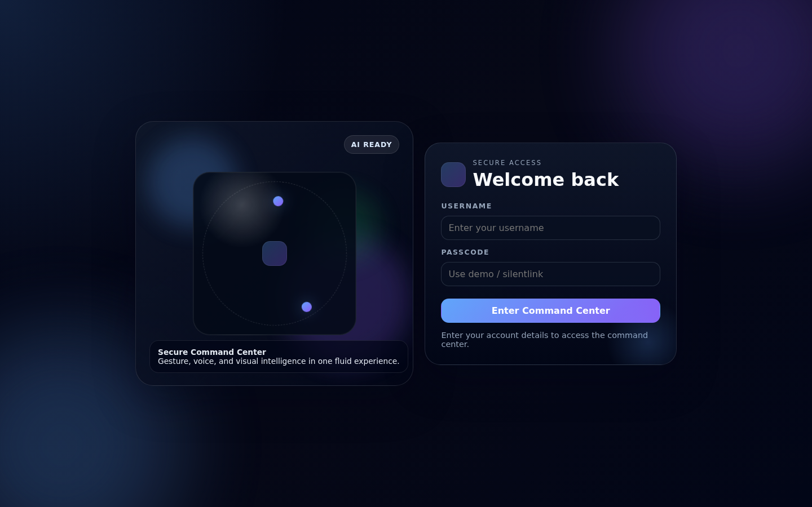
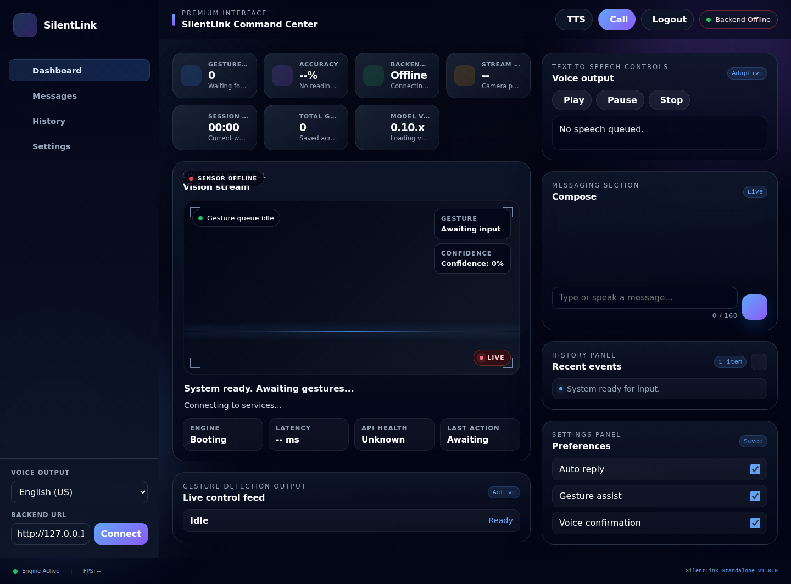
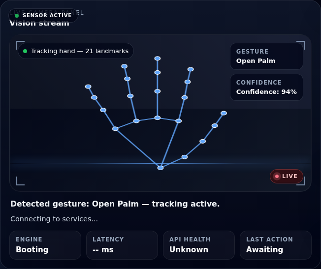

# 🤟 SilentLink

> **An AI-powered Sign Language Translation and Gesture Control System that enables intuitive, touch-free human-computer interaction using Computer Vision, Artificial Intelligence, and Real-Time Communication.**


---

# 📖 Overview

SilentLink is an AI-powered Sign Language Translation and Gesture Control System developed to improve accessibility for individuals with hearing and speech impairments. The application uses Computer Vision and Artificial Intelligence to recognize hand gestures in real time and translate them into meaningful text or system actions.

The system combines FastAPI, OpenCV, MediaPipe, and WebSockets to deliver low-latency communication between the backend and the standalone web dashboard. In addition to sign language translation, SilentLink enables gesture-based mouse control, desktop application launching, multilingual translation, and real-time interaction without requiring traditional input devices.

---

# 📸 Project Preview

Experience the modern interface of **SilentLink**, designed to provide an intelligent, intuitive, and accessible gesture-controlled computing experience. The screenshots below showcase the application's key interfaces, including secure authentication, the interactive command center, and real-time gesture recognition powered by Artificial Intelligence and Computer Vision.

---

## 🔐 Login Interface

The Login Interface provides secure access to the SilentLink Command Center through a clean, modern, and user-friendly authentication page.

<p align="center">
  
</p>

---

## 📊 SilentLink Command Center

The Command Center serves as the application's primary dashboard, providing real-time gesture recognition, backend connectivity, system monitoring, messaging, text-to-speech controls, analytics, and user preferences in a unified interface.

<p align="center">
  
</p>

---

## 🤟 Real-Time Gesture Recognition

SilentLink leverages **MediaPipe** and **OpenCV** to detect hand landmarks and recognize gestures in real time. The system displays the identified gesture along with confidence scores, enabling accurate and responsive interaction.

<p align="center">
  
</p>

---

# 🎯 Problem Statement

Millions of individuals with hearing and speech impairments face communication barriers while interacting with computers and digital systems. Conventional input devices such as keyboards and mice may not always provide the most natural or accessible interaction experience.

SilentLink addresses this challenge by leveraging AI-powered hand gesture recognition to create an intuitive, touch-free communication and control system that enhances accessibility and promotes inclusive technology.

---

# 💡 Objectives

- Develop an AI-powered gesture recognition system.
- Translate sign language into readable text.
- Enable hands-free computer interaction.
- Improve accessibility using Computer Vision.
- Demonstrate real-time communication using WebSockets.
- Build a scalable and modular software architecture.

---

# ✨ Core Features

- 🤟 Real-time hand gesture recognition
- 💬 Sign language translation
- 🖱️ Gesture-based mouse control
- 📜 Scroll, drag, and click using gestures
- 🚀 Desktop application launcher
- 🌍 Multi-language translation
- 🔊 Text-to-Speech support
- 📊 Live dashboard with analytics
- 💻 Responsive standalone web interface
- ⚡ FastAPI backend with WebSocket communication

---

# 🧠 How It Works

1. The webcam continuously captures live video frames.
2. MediaPipe detects and tracks hand landmarks.
3. The backend processes gesture data using OpenCV.
4. The Gesture Recognition Engine identifies predefined gestures.
5. FastAPI executes the corresponding action.
6. The result is displayed instantly on the web dashboard.

This architecture provides low latency, real-time performance, and easy extensibility for future gesture additions.

---


# 🏗️ System Architecture

SilentLink follows a modular client-server architecture that combines Computer Vision, Artificial Intelligence, and Real-Time Communication to provide an intuitive gesture-based interaction system.

```text
                          +----------------------+
                          |      User            |
                          |  Performs Gestures   |
                          +----------+-----------+
                                     |
                                     v
                          +----------------------+
                          |       Webcam         |
                          |  Captures Live Video |
                          +----------+-----------+
                                     |
                                     v
                          +----------------------+
                          |      MediaPipe       |
                          | Hand Landmark Detection |
                          +----------+-----------+
                                     |
                                     v
                          +----------------------+
                          |  Gesture Recognition |
                          |   (OpenCV + Python)  |
                          +----------+-----------+
                                     |
                    +----------------+----------------+
                    |                                 |
                    v                                 v
          +------------------+              +----------------------+
          | FastAPI Backend  |<------------>|  WebSocket Server    |
          | Business Logic   |   Real-Time  |  Bidirectional Comm. |
          +--------+---------+              +----------+-----------+
                   |                                   |
                   |                                   |
        +----------+----------+                        |
        |                     |                        |
        v                     v                        |
+----------------+   +--------------------+            |
| System Control |   | Translation Engine |            |
| PyAutoGUI      |   | Deep Translator    |            |
+----------------+   +--------------------+            |
                   \                 /                 |
                    \               /                  |
                     +-------------+-------------------+
                                   |
                                   v
                      +---------------------------+
                      | Standalone Web Dashboard  |
                      | HTML • CSS • JavaScript   |
                      +---------------------------+

---


# ⚙️ Technology Stack

| Category | Technologies |
|-----------|-------------|
| **Frontend** | HTML5, CSS3, JavaScript (ES6), WebSocket API |
| **Backend** | Python, FastAPI, Uvicorn |
| **Computer Vision** | OpenCV, MediaPipe, NumPy |
| **System Automation** | PyAutoGUI, PyGetWindow, PyWin32 |
| **Translation & Speech** | Deep Translator, gTTS, Web Speech API |
| **Data Storage** | JSON, Browser Local Storage |
| **Communication** | REST APIs, WebSockets |
| **Version Control** | Git, GitHub |
| **Development Tools** | Visual Studio Code, Python Virtual Environment |

---


# 📂 Project Structure

```text
SilentLink/
│
├── backend/
│   ├── main.py
│   ├── gesture_engine.py
│   ├── cursor_controller.py
│   ├── app_launcher.py
│
├── standalone_frontend/
│   ├── index.html
│   ├── login.html
│   ├── main.js
│   └── style.css
│
├── screenshots/
│   ├── login.png
│   ├── dashboard.png
│   └── tracking_open_palm.png
│
├── requirements.txt
├── Run-SilentLink.ps1
└── README.md
```

### 📖 Structure Overview

| Folder/File | Description |
|-------------|-------------|
| **backend/** | Contains the FastAPI server, gesture recognition logic, and system automation modules. |
| **standalone_frontend/** | Contains the HTML, CSS, and JavaScript files for the user interface. |
| **screenshots/** | Stores images used in the README for project preview. |
| **requirements.txt** | Lists all required Python packages and dependencies. |
| **Run-SilentLink.ps1** | PowerShell script to launch the application on Windows. |
| **README.md** | Comprehensive project documentation, setup guide, and usage instructions. |

```

---

# 🔄 Workflow

```text
        User
          │
          ▼
      Webcam
          │
          ▼
     MediaPipe
          │
          ▼
 Gesture Recognition
          │
          ▼
   FastAPI Backend
          │
  ┌───────┴────────┐
  ▼                ▼
Translation   System Commands
  │                │
  └───────┬────────┘
          ▼
Standalone Web Dashboard
```

---

# 🚀 Getting Started

Follow the setup guide below to run SilentLink locally.

## Prerequisites

- Python 3.10+
- Git
- Visual Studio Code
- Webcam

### Clone Repository

```bash
git clone https://github.com/Nageswari2005/SilentLink.git
cd SilentLink
```

### Create Virtual Environment

```bash
python -m venv .venv
```

### Activate Environment

Windows

```bash
.\.venv\Scripts\activate
```

Linux/macOS

```bash
source .venv/bin/activate
```

### Install Dependencies

```bash
pip install -r requirements.txt
```

### Start Backend

```bash
python backend/main.py
```

or

```bash
uvicorn backend.main:app --reload
```

### Launch Frontend

```bash
cd standalone_frontend
python -m http.server 5500
```

Visit

```
http://localhost:5500/login.html
```

---
# 🎯 Key Capabilities

SilentLink enables users to:

- Translate sign language into readable text.
- Control the mouse using hand gestures.
- Execute desktop commands without a keyboard or mouse.
- Launch desktop applications through gestures.
- Communicate using multilingual translation.
- Convert text into speech.
- View real-time analytics through an interactive dashboard.
- Interact with a responsive web application.
- Experience real-time communication powered by FastAPI and WebSockets.

---

# 🚀 Future Enhancements

- JWT-based user authentication.
- Database integration using SQLite or PostgreSQL.
- AI model training with custom gesture datasets.
- Support for additional regional sign languages.
- Android and iOS mobile applications.
- Cloud synchronization.
- Voice command integration.
- Docker containerization.
- Cross-platform desktop application.
- Smart Home and IoT integration.
- Advanced analytics dashboard.
- Performance optimization under varying lighting conditions.

---


# 🤝 Contributing

Contributions are welcome.

To contribute:

1. Fork the repository.
2. Create a feature branch.
3. Commit your changes.
4. Push the branch.
5. Open a Pull Request.

---

# 📄 License

This project is developed for educational and research purposes as part of a Bachelor of Technology (B.Tech) final-year project.

You are welcome to explore, learn from, and reference this project. For commercial use or redistribution, please obtain prior permission from the author.

---

# 👩‍💻 Author

**Velpula Nageswari**

B.Tech – Computer Science and Engineering

Malla Reddy Engineering College for Women

GitHub: https://github.com/Nageswari2005


